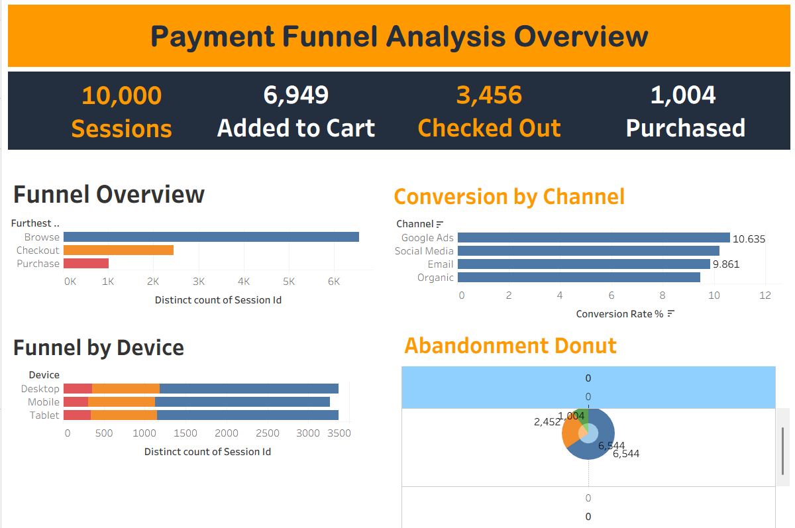
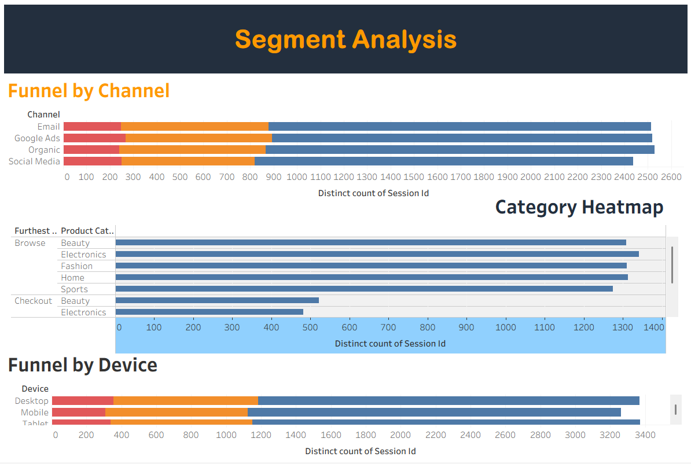
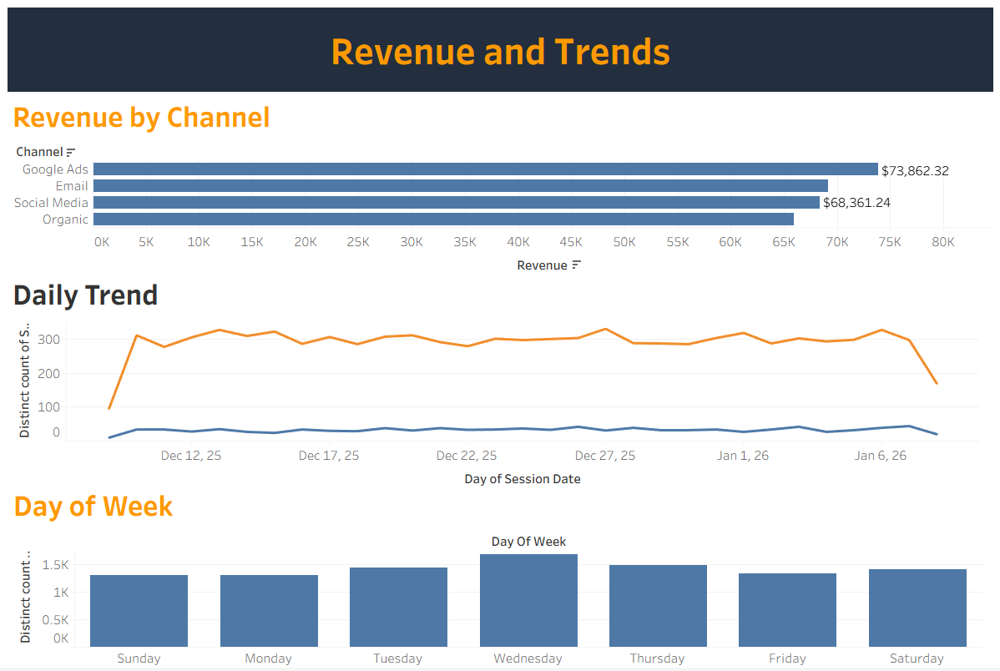

# SQL & Tableau E-Commerce Payment Funnel Analysis: Diagnosing a 90% Checkout-to-Purchase Drop-Off

End-to-end funnel analytics project that tracks 10,000 e-commerce sessions from Browse → Add to Cart → Checkout → Purchase using **T-SQL** for data modeling/analysis and **Tableau** for dashboarding, to identify where and why revenue is leaking out of the payment funnel.



---

## Executive Summary

**Business problem:** Out of 10,000 sessions, only 1,004 (10.04%) resulted in a completed purchase. Leadership had no visibility into *which* funnel stage, device, channel, or product category was driving the biggest revenue loss, making it impossible to prioritize fixes.

**Solution:** Built a T-SQL pipeline that cleans raw event-level data, models it into a session-level funnel table, and calculates stage-by-stage conversion, abandonment, revenue, and segment (device/channel/category/region) performance. Published the results as an interactive 3-page Tableau dashboard for stakeholders to self-serve.

**Numbers impact:**
- **10,000 sessions → 6,949 carts → 3,456 checkouts → 1,004 purchases** (10.04% overall conversion)
- **Checkout is the single biggest leak:** 2,452 of 3,456 checkout sessions (70.95%) abandon before paying — only 29.05% of checkouts convert
- **$277,323.06** in total revenue tracked, at a **$276.32** average order value
- **Google Ads** is the highest-converting channel (10.63%) and top revenue driver ($73,862.32); **Organic** is the weakest (9.45%)
- **Desktop** converts best (10.58%); **Mobile** lags (9.47%) despite similar traffic volume
- **Electronics** converts best by category (11.16%); **Home** is weakest (9.30%)

**Next steps:** Run a checkout UX audit (payment methods, form friction, shipping-cost surprises) and a mobile-specific usability review, since these two segments show the clearest, highest-value opportunity for lift (see [Next Steps](#next-steps--limitations) for detail).

---

## Business Problem

The business had raw clickstream/event data but no structured way to answer basic funnel questions:
- Where exactly do users drop off, and how severe is each drop-off?
- Which channels, devices, and product categories are worth more marketing/UX investment, and which are underperforming?
- How much revenue is at stake if drop-off at the worst stage were reduced?

Without this, marketing spend and product/UX effort were being allocated on gut feel rather than evidence. A clear, quantified view of the funnel directly informs where to spend the next dollar of CRO (conversion rate optimization) investment and how to forecast the revenue return of fixing it.

---

## Methodology

1. **Data ingestion & cleaning (SQL):** Loaded raw session-event data into SQL Server, cast/typed fields, checked for duplicate events and nulls, and confirmed event-name distribution before analysis.
2. **Funnel modeling (SQL):** Used CTEs and window functions (`LAG`, `PERCENTILE_CONT`, `ROW_NUMBER`) to calculate stage-to-stage conversion, drop-off %, and to build a single flat session-level table (`funnel_tableau_export`) with one row per session and every attribute needed downstream.
3. **Segmentation (SQL):** Broke the funnel out by device, channel, product category, region, and day of week; calculated revenue and abandonment at each cut.
4. **Visualization (Tableau):** Connected Tableau to the exported session-level table and built a 3-page dashboard: Funnel Overview, Revenue & Trends, and Segment Analysis.
5. **Interpretation:** Translated the numbers into concrete, stakeholder-facing recommendations (below).

**Tools:** T-SQL (SQL Server), Tableau Desktop, Excel/CSV for data exchange.

---

## Skills

- **SQL:** CTEs, window functions (`LAG()`, `PERCENTILE_CONT()`, `ROW_NUMBER()`), conditional aggregation (`CASE WHEN` pivoting), `NULLIF`-safe division for rate calculations, data quality checks (duplicate/null detection), building analysis-ready flat export tables from normalized event data.
- **Funnel/product analytics:** Stage-to-stage conversion rate modeling, cart/checkout abandonment segmentation, cohort-style time-to-convert analysis, revenue attribution by channel/device/category.
- **Tableau:** Multi-page dashboard design, dual-axis and pivoted bar charts, funnel/donut visualizations, calculated fields for conversion %, cross-filtering across pages.
- **Data storytelling:** Turning raw conversion metrics into prioritized, revenue-quantified business recommendations.

---

## Results & Business Recommendations

| Finding | Recommendation | Expected Benefit |
|---|---|---|
| Checkout → Purchase converts at only 29.05% — the steepest drop of any stage (2,452 sessions lost) | Audit the checkout flow: payment options, form length, and surprise costs (shipping/tax shown late). Run an A/B test on a simplified/guest checkout. | This is the highest-leverage fix in the funnel — even a 5-point lift here (to ~34%) would add roughly 170 more purchases at current traffic, worth an estimated **$47K+** in incremental revenue at current AOV. |
| Mobile converts 1.1 points below Desktop (9.47% vs 10.58%) despite comparable traffic (3,263 vs 3,366 browse sessions) | Run a mobile checkout usability review (tap targets, autofill, page load speed) before increasing mobile ad spend. | Closing the mobile gap to Desktop's rate would add ~35 incremental purchases without spending more on acquisition. |
| Organic traffic has the lowest conversion (9.45%) despite comparable volume to paid channels | Investigate search intent/landing page mismatch for organic visitors; consider tailored landing pages by top organic queries. | Improves ROI of existing SEO investment without added spend. |
| Google Ads has the best conversion (10.63%) and highest revenue ($73,862.32) | Reallocate incremental marketing budget toward Google Ads, and use its landing page/audience setup as a template for other channels. | Directly compounds the channel already proven to convert. |
| Home and Beauty categories convert below Electronics/Fashion (9.30%–9.45% vs 10.5%+) | Review product page content and pricing/promo strategy for Home and Beauty; test cross-sell placement with higher-converting categories. | Targeted category-level lift rather than blanket site-wide changes. |
| 30.5% of sessions never make it past Browse (never add anything to cart) | Review product discovery/search relevance and consider exit-intent offers on browse-only sessions. | Addresses the largest single group of non-converters, upstream of checkout. |



---

## Next Steps & Limitations

- **Synthetic/sample data:** This dataset covers a single ~4-week window; seasonality, promotions, and longer-term trend effects aren't captured. With more time, I'd validate these patterns against a full quarter or year of data.
- **No user-level history:** The analysis is session-based; it doesn't distinguish new vs. returning users. Given more time/data, I'd add a returning-vs-new-user cut, since repeat visitors typically convert differently than first-time sessions.
- **No cost data:** Revenue is tracked, but channel acquisition cost (CPC/CPA) isn't in this dataset, so recommendations are directional (conversion rate and revenue) rather than full ROI/CAC-based. Adding marketing spend data would let this become a true ROI model.
- **No qualitative context:** The data shows *where* people drop off but not *why*. The checkout-audit recommendation above should be paired with session replay/heatmap tools or user testing to confirm root causes before building fixes.
- **Statistical significance:** Segment differences (e.g., Mobile vs. Desktop, Organic vs. paid) are directional based on the sample size available; I'd run a formal significance test before treating small gaps as decisive.

---

## Repository Structure

```
payment-funnel-analysis/
├── README.md
├── sql/
│   └── payment_funnel_analysis.sql        # full analysis: cleaning, funnel, segmentation, revenue, export
├── data/
│   └── funnel_raw_data.csv                # raw session-event level input data
├── exports/
│   └── funnel_tableau_export.csv          # session-level table exported for Tableau
├── tableau/
│   └── payment_funnel_dashboard.twbx      # packaged Tableau workbook
└── images/
    ├── dashboard_overview.png
    ├── dashboard_revenue.png
    └── dashboard_segments.png
```

## Dashboard

- **Page 1 — Funnel Overview:** stage volumes, conversion by channel, funnel by device, abandonment breakdown
- **Page 2 — Revenue & Trends:** revenue by channel, daily trend, day-of-week volume
- **Page 3 — Segment Analysis:** funnel by channel/device, category heatmap by furthest stage reached



## Tools Used

`SQL Server (T-SQL)` · `Tableau Desktop` · `Excel/CSV`
